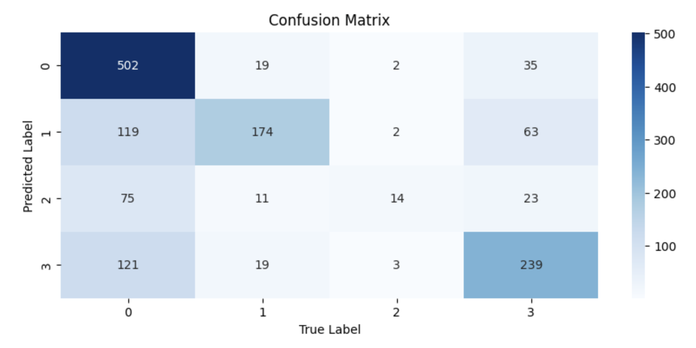

# Hi, I'm Haris! 👋


[](https://choosealicense.com/licenses/mit/) 


# Multinomial Naive Bayes Assignment

This repository contains a Jupyter Notebook that demonstrates a simple implementation of Multinomial Naive Bayes using Python. The notebook walks through the steps of loading data, preprocessing, training the model, and visualizing the results. Alongside the Jupyter Notebook, there is also a corresponding .py python file.
The Naive Bayes folder contains the following files:
- A .ipynb file (Jupyter Notebook) that contains all the code regarding the assignment including text blocks explaining portions of the code
- A corresponding .py file
- A .png file that is a screenshot of the confusion matrix of the Naive Bayes model when run on the test dataset
- Three .csv files (emotion_train_data.csv, emotion_validation_data.csv and emotion_test_data.csv) that contain all the raw data on which the Naive Bayes model is trained and tested. You can download and save the .csv file in your computer and open it as an Excel file for better readability.


## Table of Contents

1. [Introduction](#introduction)
2. [Installation Requirements](#installation-requirements)
3. [Project Structure](#project-structure)
4. [Data](#data)
5. [Training and Evaluation](#training-and-visualization)
6. [Lessons](#lessons)
7. [Screenshots](#screenshots)
   
## Introduction

Multinomial Naive Bayes is a probabilistic machine learning algorithm based on Bayes' theorem, commonly used for text classification. It assumes features (e.g., word frequencies) follow a multinomial distribution and are conditionally independent given the class. This simplicity makes it efficient and effective for tasks like spam detection or sentiment analysis. This assignment provides a clear and concise example of how to implement Naive Bayes from scratch using Python. The assignment explores how to classify a dataset of tweets into different categories of sentiments.

## Installation Requirements

To run this notebook, you will need the following packages:
- numpy
- pandas
- matplotlib
- seaborn
- regex
- sklearn
- nltk
- datasets

You can install these packages using pip:

```bash
 pip install numpy
```
```bash
 pip install pandas
```
```bash
 pip install matplotlib 
```
```bash
 pip install seaborn
```
```bash
 pip install matplotlib
```
```bash
 pip install regex
```
```bash
 pip install sklearn
```

To install the datasets and nltk libraries, simply run the first code block in the Jupyter Notebook. Running this cell may take some time (approximately 2 to 5 minutes for the first time you run it). 

Useful Links for installing Jupyter Notebook:
- https://youtube.com/watch?v=K0B2P1Zpdqs  (MacOS)
- https://www.youtube.com/watch?v=9V7AoX0TvSM (Windows)
    
## Project Structure

The notebook is organized into the following sections:

1) Introduction: Overview of the project objectives <br>
2) Library Imports: Importing all the libaries needed for the assignment <br>
3) Data Loading: Steps to load the dataset. <br>
4) Data Preprocessing: Steps to preprocess the dataset <br>
5) Model Implementation: Training the Naive Bayes model. <br>
6) Model Evaluation: Evaluating the model performance on the validation dataset and then on the test dataset <br>
7) Implementation of the Sklearn version of the Model

## Data

**Tweet Evaluation Dataset**: Instead of downloading the dataset manually, we will be using the [`datasets`](https://huggingface.co/docs/datasets) library from Hugging Face to automatically download and manage the Tweet Eval dataset. This library is part of the Hugging Face ecosystem, widely used for Natural Language Processing (NLP) tasks. The `datasets` library not only downloads the dataset but also offers a standardized interface for accessing and handling the data, making it compatible with other popular libraries like Pandas and PyTorch. 

The three .csv files given in this repository were downloaded by running the code block under the 'Loading Dataset' markdown in the Jupyter Notebook. The dataset has two columns: `text` and `label`, where `text` is the sentence and `label` is the emotion label. The goal is to classify tweets into various emotional categories (e.g., joy, sadness, anger) by analyzing their content.

You can explore the extensive list of datasets available on Hugging Face [here](https://huggingface.co/datasets).


## Training and Visualization

The entire training process alongside the maths involved is explained in detail in the jupyter notebook. 
- Note: A good knowledge of Probability is required to fully understand the Naive Bayes algorithm, especially the concept of conditional probabilties and Bayes' Theorm.
Useful Links for understanding these concepts:
- [https://youtube.com/watch?v=K0B2P1Zpdqs](https://youtu.be/_IgyaD7vOOA?si=TdchAf_JmC9ymkfe)  (MacOS)
- https://youtu.be/9wCnvr7Xw4E?si=boWFV0JIQz3GDITF (Bayes' Theorem)

## Lessons

A linear regression project can teach a variety of valuable skills and concepts, including:

- Data Preprocessing: How to clean and prepare data for analysis, including handling missing values, scaling features, and encoding categorical variables.

- Feature Selection: Identifying which features (variables) are most important for making predictions and how to choose them effectively.

- Model Building: Understanding how to build a linear regression model, including splitting data into training and testing sets, fitting the model, and making predictions.

- Performance Evaluation: Using metrics like Root Mean Squared Error (RMSE) to evaluate the performance of your model and understand its accuracy.

- Interpreting Results: Understanding the coefficients of the linear regression model and what they signify in terms of the relationships between variables.

- Visualization: Using visualization tools to plot data, visualize the regression line, and understand the relationship between variables.

- Algorithm Implementation: Learning about the underlying algorithm used in linear regression and how it optimizes the line of best fit.


## Screenshots
<h3> (a) Univariate Linear Regression </h3>
<h4> 1. This image shows a regression line and the data points of the <strong> training dataset </strong>, where Present_Tmax is plotted on the x-axis and Next_Tmax is plotted on the y-axis. </h4>
 <br> 

<h4> 2. This image shows a regression line and the data points of the <strong> testing dataset </strong>, where Present_Tmax is plotted on the x-axis and Next_Tmax is plotted on the y-axis. </h4>
 <br> 

<h4> 3. This image shows the correlation between the various input variables in the .csv file and the output variable (Next_Tmax). More details about correlation are in the Jupyter Notebook. </h4>
 <br>

<h4> 4. This image shows a regression line and the data points of the <strong> training dataset </strong>, where the input variable having the highest correlation with the output variable (LDAPS_Tmax_lapse) is plotted on the x-axis and Next_Tmax is plotted on the y-axis. </h4>
 <br>

<h4> 5. This image shows a regression line and the data points of the <strong> testing dataset </strong>, where the input variable having the highest correlation with the output varaible (LDAPS_Tmax_lapse) is plotted on the x-axis and Next_Tmax is plotted on the y-axis. </h4>
 <br> <br> <br>

<h3> (b) Multivariate Linear Regression </h3>
<h4> 1. This image shows the number of epochs on the x-axis plotted against the cost value on the y-axis, when the <strong>top five </strong> input features from the raw dataset are used in the gradient descent algorithm.</h4>
 <br>

<h4> 2. This image shows the number of epochs on the x-axis plotted against the cost value on the y-axis, when <strong> ALL </strong> the input features from the raw dataset are used in the gradient descent algorithm.</h4>


## License

[MIT](https://choosealicense.com/licenses/mit/)
